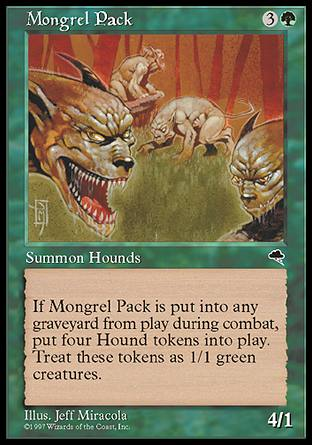

!SLIDE title-slide
# Serwowanie aplikacji Rails

## a jakie jest Twoje ulubione rozwiązanie?

!SLIDE left-img

# Mongrel

## (klaster mongreli)

!SLIDE left-img

# Passenger

## Apache/Nginx

!SLIDE bullets incremental

# Dlaczego nie?

* bycie mniejszością suxx
* passenger: pierwsze żądanie trwa wieki
* mongrel: zarządzanie procesami, start
* bezkompromisowe wymagania

!SLIDE center

# Unicorn na ratunek!

